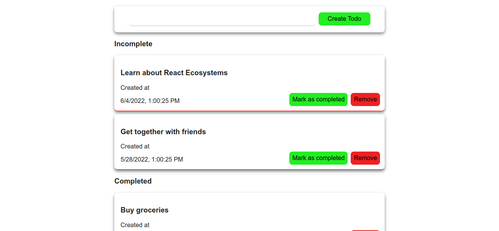

<h3 align="center">Access-Todos</h3>

<div align="center">

[](https://github.com/rawda-developer/Access-todos)
[](https://github.com/rawda-developer/Access-todos/issues)
[](https://github.com/rawda-developer/Access-todos/pulls)
[](/LICENSE)

</div>

---

<p align="center">



</p>

## 📝 Table of Contents

- [About](#about)
- [Getting Started](#getting_started)

- [Usage](#usage)
- [Built Using](#built_using)

- [Authors](#authors)

## 🧐 About <a name = "about"></a>

Access Todo allows users to manage their todo list items, add, update, and delete them. It's built using React and Node.js. It uses React ecosystem components such as Redux, and thunk.

## 🏁 Getting Started <a name = "getting_started"></a>

### Prerequisites

Make sure that you install node.js, and npm

```
node -v
npm -v

```

### Installing

```
git clone https://github.com/rawda-developer/Access-todos

cd Access-todos
```

#### Frontend

```
npm install
npm start
```

#### Backend

```
cd react-ecosystem-server
npm install
npm run dev
```

## 🔧 Running the tests <a name = "tests"></a>

### Frontend

```
npm run test
```

## 🎈 Usage <a name="usage"></a>

Use this project as a guide to your next MERN Stack project

## ⛏️ Built Using <a name = "built_using"></a>

- [MongoDB](https://www.mongodb.com/) - Database
- [Express](https://expressjs.com/) - Server Framework
- [ReactJs](https://reactjs.org/) - Web Framework
- [NodeJs](https://nodejs.org/en/) - Server Environment

## ✍️ Authors <a name = "authors"></a>

- [@RawdaDeveloper](https://github.com/rawda-developer/) - Idea & Initial work
